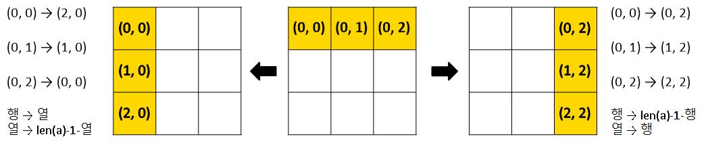

# 이차원 리스트

## 이차원 리스트란?

리스트를 원소로 가지는 리스트 → 행렬을 표현할 수 있음
```python
matrix = [[1, 2, 3], [4, 5, 6], [7, 8, 9]]

matrix = [
  [1, 2, 3], # 0
  [4, 5, 6], # 1
  [7, 8, 9]] # 2
 # 0  1  2 
```

> 이차원 리스트는 행렬(matrix)이다.

<br>

## 이차원 리스트 만들기
1. 직접 작성

2. 반복문
    ```python
    matrix = []
    # 0으로 이루어진 nxm 행렬
    for _ in range(n):
      matrix.append([0] * m)
    ```

3. list comprehension
    ```python
    matrix = [[0]*m for _ in range(n)]
    ```

<br>

## 입력 받기
1. for 문
    ```python
    matrix = []
    for _ in range(n):
      matrix.append(list(input()))
    ```

2. list comprehension
    ```python
    matrix = [list(input()) for _ in range(n)]
    ```

<br>

## 순회
```python
matrix = [
  [1, 2, 3, 4], 
  [5, 6, 7, 8], 
  [9, 0, 1, 2]
]
# 행 우선 순회
for i in range(3):
  for j in range(4):
    print(matrix[i][j], end=' ')
  print()
```
i와 j 를 바꾸면 열 우선 순회!

### 총합 구하기

1. for문 이용
    ```python
    matrix = [
      [1, 1, 1, 1], 
      [1, 1, 1, 1], 
      [1, 1, 1, 1]
    ]
    total = 0
    for i in range(3):
      for j in range(4):
        total += matrix[i][j]
    ```

2. pythonic한 방법
    ```python
    total = sum(map(sum, matrix))
    ```

### 최대값, 최소값
```python
max_value = max(map(max, matrix))
min_value = min(map(min, matrix))
```

<br>

## 전치 transpose
> 행과 열을 맞바꾸는 것
```python
matrix = [
  [1, 2, 3, 4], 
  [5, 6, 7, 8], 
  [9, 0, 1, 2]
]

trans_matrix = [[0]*3 for _ in range(4)]
for i in range(3):
  for j in range(4):
    trans_matrix[i][j] = matrix[j][i]
```
빈 matrix를 만든 후 원본의 행과 열을 바꿔 대입
3x4 행렬 → 4x3 행렬

<br>

## 회전

### 왼쪽으로 90도 회전
```python
matrix = [
  [1, 2, 3], 
  [4, 5, 6], 
  [7, 8, 9]
]
n = 3
turn_matrix = [[0]*n for _ in range(n)]

for i in range(n):
  for j in range(n):
    turn_matrix[i][j] = matrix[j][n-1-i]
```

### 오른쪽으로 90도 회전
```python
for i in range(n):
  for j in range(n):
    turn_matrix[i][j] = matrix[n-1-j][i]
```

### 180도 회전
```python
for i in range(n):
  for j in range(n):
    turn_matrix[i][j] = matrix[n-1-i][n-1-j]
```

### zip 함수
- 기본 형태
  ```python
  zip(iterable, iterable.....)
  ```

- 각 iterable의 i 번째 항목들을 묶어 tuple 생성
  ```python
  for i in zip(range(3), ['strawberry', 'grapes', 'peach'])
    print(i)

  # (0, 'strawberry')
  # (1, 'grapes')
  # (2, 'peach')
  ```

- 행과 열 바꾸기(전치)
  ```python
  matrix = [
    [1, 2, 3], 
    [4, 5, 6], 
    [7, 8, 9]
  ]

  print(list(zip(*matrix)))
  # [(1, 4, 7), (2, 5, 8), (3, 6, 9)]
  ```
