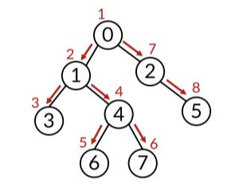

# DFS와 BFS

## 그래프 탐색 알고리즘

- 그래프 자료구조는 탐색 알고리즘에 활용됨

- 그래프 탐색 알고리즘이란 시작 정점에서 간선을 타고 이동할 수 있는 모든 정점을 찾는 알고리즘

- 그래프 탐색 알고리즘에는 깊이우선탐색과 너비우선탐색이 있음
  - 깊이우선탐색(DFS, Depth-First Search) : 그래프의 깊이를 우선으로 탐색하기 위해 `스택`을 활용

  - 너비우선탐색(BFS, Breadth-First Search) : 그래프의 너비를 우선으로 탐색히가 위해 `큐`를 활용

<br>

## 깊이우선탐색 DFS(Depth-First Search)

### 개념과 특징

- 시작 정점으로부터 갈 수 있는 하위 정점까지 가장 깊게 탐색

- 더이상 갈 곳이 없으면 마지막 갈림길로 돌아와 다른 정점을 탐색하며 모든 정점을 순회하는 방법

- 가장 마지막 갈림길로 돌아가야하기 때문에 후입 선출 구조의 `스택` 활용이 적합

- 특징
  - 모든 정점을 방문할 때 유리함(경우의 수, 순열과 조합 문제에서 많이 사용)
  - BFS에 비해 코드 구현이 간단함.
  - 모든 정점을 방문할 필요가 없거나 최단 거리를 구하는 경우 BFS가 유리함


### DFS의 동작 과정
- 탐색을 진행할 그래프(인접행렬 또는 인접 리스트)와 각 정점을 방문했는지를 기록할 체크리스트 필요

- 현재 정점 방문처리 → 인접한 모든 정점 확인 → 방문하지 않은 인접 정점 이동


### DFS의 구현 방식
```python
# 탐색할 그래프(인접 리스트)
graph = [
  [1, 2],    # 0
  [0, 3, 4], # 1
  [0, 4, 5], # 2
  [1],       # 3
  [1, 2, 6], # 4
  [2],       # 5
  [4]        # 6
]

visited [False] * 7 # n개의 방문 처리 리스트 생성
# [False, False, False, False, False, False, False]

def dfs(start):
  stack = [start]   # 돌아갈 곳을 기록(이전의 방문기록)
  visited[start] = True

  # 방문 시작, 스택이 빌때까지 순회
  while stack:
    cur = stack.pop()    # 현재 방문정점

    # 현재 정점의 인접노드 순회
    for adj in graph[cur]:
      if not visited[adj]:
        visited[adj] = True   # 방문기록 남기기
        stack.append(adj)     # 돌아갈 곳으로 기록

dfs(0)
```

<br>

## 너비우선탐색 BFS(Breadth-First Search)

### 개념과 특징
- 시작 정점에서 가까운 노드부터 우선적으로 탐색하는 알고리즘

- 가까운 노드를 순차적으로 순회해야 하므로 선입선출 구조의 `큐`가 적합

- 특징 : 모든 정점을 방문할 필요가 없거나 최단거리를 구하는 경우 활용도가 높음

### BFS의 동작 과정
- 탐색을 진행할 그래프(인접행렬 또는 인접 리스트)와 각 정점을 방문했는지를 기록할 체크리스트 필요

- 현재 정점 방문처리 → 인접한 정점을 큐에 넣고 순차적 방문

### BFS의 구현 방식
```python
from collections import deque
# 탐색할 그래프(인접 리스트)
graph = [
  [1, 2],    # 0
  [0, 3, 4], # 1
  [0, 4, 5], # 2
  [1],       # 3
  [1, 2, 6], # 4
  [2],       # 5
  [4]        # 6
]

visited [False] * 7 # n개의 방문 처리 리스트 생성
# [False, False, False, False, False, False, False]

def bfs(start):
  queue = deque([start])
  visited[start] = True

  # 방문 시작, 큐가 빌때까지 순회
  while queue:
    cur = queue.popleft()    # 현재 방문정점

    # 현재 정점의 인접노드 순회
    for adj in graph[cur]:
      if not visited[adj]:
        visited[adj] = True   # 방문기록 남기기
        queue.append(adj)     

dfs(0)
```

<br>

## DFS와 BFS 비교

모두 인접리스트 사용 시 O(n+e), 인접 행렬 사용 시 O(n^2)의 시간복잡도를 가짐

### DFS의 특징
- 현재 경로에 있는 노드들만 저장하기 때문에 메모리를 적게 사용

- 모든 노드를 방문하고자 할 때 사용

- 목표 노드가 깊은 단계에 있는 경우 BFS보다 빠름

- 재귀함수 사용 가능

- 해가 없는 경로라도 끝까지 탐색하므로 상황에 따라 효율적이지 않을 수 있음

### BFS의 특징
- 모든 경로를 단계적으로 탐색하기 때문에 답이 여러 개 존재해도 최단경로임을 보장함

- 시간 복잡도는 탐색하는 그래프/트리의 크기에 비례, 노드 수가 적고 답의 깊이가 얕을 때 유리함

- 간선으로 연결된 모든 노드를 저장하므로 메모리를 더 많이 사용