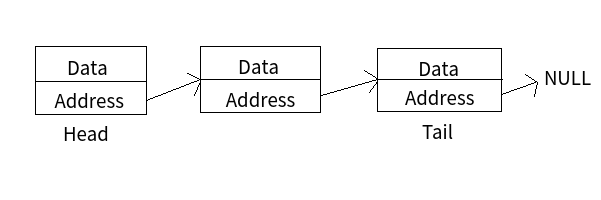

# 리스트 List

## 배열과 연결리스트

### 배열 Array

> 여러 데이터들이 연속된 메모리 공간에 저장되어 있는 자료구조

```C
int arr[5] = {70, 80, 20, 100, 90};
```
- index를 통해 데이터에 빠르게 접근

- 배열의 길이는 변경 불가능, 변경하려면 새로 생성

- 데이터 타입 고정

### 연결 리스트 Linked List

> 데이터가 담긴 여러 노드들이 순차적으로 연결된 형태의 지료구조



- 처음 노드부터 순차적으로 탐색

- 연결 리스트의 길이 자유롭게 변경 가능 -> 삽입, 삭제 편리

- 다양한 데이터 타입 저장

- 데이터가 메모리에 연속적으로 저장되지 않음

<br>

__배열과 연결리스트를 합친게 파이썬의 리스트__

<br>
<br>

## 파이썬의 List

- 인덱스로 데이터에 접근 가능

- 길이 자유롭게 변경 가능