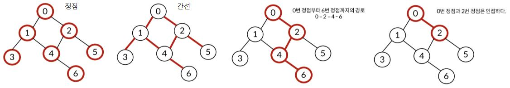

# 그래프

## 그래프의 이해

### 그래프란
- 정점(Vertex)과 이를 연결하는 간선(Edge)들의 집합으로 이루어진 비선형 자료구조

- 소셜 네트워크, 지하철 노선도 같이 개체 간의 관계를 나타내기 위해 사용


### 그래프 관련 용어

- 정점 Vertex : 간선으로 연결되는 객체이며, Node라고도 함

- 간선 Edge : 정점 간의 관계(연결)를 표현하는 선을 의미

- 경로 Path : 시작 정점부터 도착 정점까지 거치는 정점을 나열한 것을 의미

- 인점 Adjacency : 두개의 정점이 하나의 간선으로 직점 연결된 상태를 의이

<br>

## 그래프의 종류
### 1. 무방향 그래프 Undirected graph
  - 간선의 방향이 없는 가장 일반적인 그래프

  - 간선을 통해 양방향의 정점 이동 가능

  - `차수`(Degree) : 하나의 정점에 연결된 간선의 개수

  - 모든 정점의 차수의 합 = 간선 수 x 2

### 2. 유방향 그래프 Directed graph
  - 간선의 방향이 있는 그래프

  - 간선의 방향이 가리키는 정점으로 이동 가능

  - `차수`(Degree) : 진입 차수와 진출 차수로 나누어짐
    - 진입 차수(In-degree) : 외부 정점에서 한 정점으로 들어오는 간선의 수
    - 진출 차수(Out-degree) : 한 정점에서 외부 정점으로 나가는 간선의 수

<br>

## 그래프의 표현

### 1. 인접 행렬 Adjacent matrix
- 두 정점을 연결하는 간선이 없으면 0, 있으면 1을 가지는 행렬로 표현하는 방식
  ```python
  # 정점의 수
  n = 5
  # 간선의 수
  m = 5

  # 5*5 행렬 0으로 초기화
  graph = [[0]*n for _ in range(n)]
  for _ in range(m):
    a, b = map(int, input().split())
    graph[a][b] = 1
    graph[b][a] = 1

  # 예시  (대칭 형태)
  # [[0, 1, 1, 0, 0],
  #  [1, 0, 0, 1, 1],
  #  [1, 0, 0, 0, 1],
  #  [0, 1, 0, 0, 0],
  #  [0, 1, 1, 0, 0]]
  ```

### 2. 인접 리스트 Adjacent list
- 리스트를 통해 각 정점에 대한 인접 정점들을 순차적으로 표현하는 방식
  ```python
  # 정점의 수
  n = 5
  # 간선의 수
  m = 5

  # 0으로 초기화할 필요 없음
  graph = [[] for _ in range(n)]

  for _ in range(m):
    a, b = map(int, input().split())
    graph[a].append(b)
    graph[b].append(a)

  # 예시
  # [[0, 1, 2],
  #  [1, 0, 3, 4],
  #  [2, 0, 4],
  #  [3, 1],
  #  [4, 1, 2]]
  ```

### 3. 인접 행렬 vs 인접 리스트

- 인접 행렬은 직관적이고 만들기 편하지만, 불필요하게 공간 낭비

- 인접 리스트는 연결된 정점만 저장하여 효율적이므로 자주 사용

- 정점, 간선의 수에 따라 적절한 방법 선택
  - 정점 수 8, 간선 수 50 이면 인접 행렬이 적절
  - 정점 수 100, 간선 수 5 이면 인접 리스트가 적절