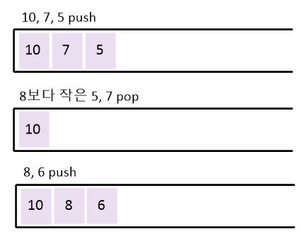

# monotone stack

### 개념

- 스택에 원소들을 오름차순 또는 내림차순이 유지될 수 있도록 push와 pop을 하는 것

- 특정 문제에서 시간 복잡도를 O(N)으로 줄일 수 있음

### 예시

숫자 10, 7, 5, 8, 6 이 순서대로 입력되었을 때 stack 내림차순으로 유지




### 예제

[BOJ 옥상정원 꾸미기 [6198](https://www.acmicpc.net/problem/6198)]

```python
import sys
input = sys.stdin.readline

n = int(input())
b = [int(input()) for _ in range(n)]
view = []
ans = 0

for i in range(n):
  # 현재 stack에 들어가야하는 값보다 작은 값을 모두 제거
    while view and view[-1] <= b[i]:
        view.pop()
  # 큰 값만 남았을 때 append
    view.append(b[i])
    ans += len(view) - 1

print(ans)
```