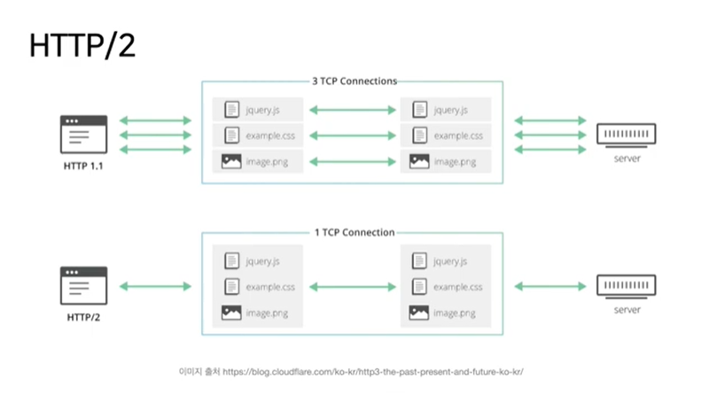

# HTTP

## 목차

- [Protocol](#protocol)
- [HTTP](#http-1)
- [HTTP version](#http-version)
- [참고 자료](#참고자료)

## protocol

둘 이상의 통신 개체 간에 교환되는 메시지 포맷과 순서뿐만 아니라, 메시지의 송수신과 다른 이벤트에 따른 행동들을 정의한다.

 

## HTTP

HyperText Transfer Protocol로 웹의 애플리케이션 계층의 프로토콜이다. 메시지의 구조 및 클라이언트와 서버가 메시지를 어떻게 교환하는지 정의한다.

HTTP는 TCP/IP를 전송 프로토콜로 사용하는데 흐름은 아래와 같다.

### 클라이언트

소켓 인터페이스(클라/서버와 TCP 연결 출입구)를 통해 TCP 접속

→ 클라이언트가 HTTP 요청 메시지를 소켓 인터페이스로 보냄

→ 소켓 인터페이스로부터 HTTP 응답을 받음

### 서버

소켓 인터페이스(클라/서버와 TCP 연결 출입구)를 통해 TCP 접속

→ 소켓 인터페이스로부터 HTTP 요청을 받음

→ 응답 메시지를 소켓 인터페이스로 보냄

 

## Request & Response

통신 과정에서 주고 받는 요청과 응답은 아래와 같은 구조로 이루어져 있다.

### HTTP Request message

- start line

  - HTTP method : GET, POST, PUT, DELETE

  - Request target : HTTP Request가 전송되는 목표 주소

  - HTTP version : version에 따라 메시지 구조/데이터 구조 등이 다를 수 있어 명시

- headers : request에 대한 추가 정보

  - Host : 요청하려는 서버 호스트 이름과 포트번호

  - User-agent : 클라이언트 프로그램 정보, 이 정보를 통해 서버는 클라이언트 프로그램에 맞는 최적의 데이터를 보내줌

  - Referer : 바로 직전에 머물렀던 웹 링크 주소

  - Accept : 클라이언트가 처리 가능한 미디어 타입 종류 나열

  - If-Modified-Since : 여기에 쓰여진 시간 이후로 변경된 리소스 취득, 페이지가 수정되었으면 최신 페이지로 교체한다.

  - Authorization : 인증 토큰을 서버로 보낼 때 사용

  - Origin : 서버로 Post 요청을 보낼 때 요청이 어느 주소에서 시작되었는지 나타내는 값, 이 값으로 보낸 주소와 받는 주소가 다르다면 CORS(Cross-Origin Resoure Sharing) Error 발생

  - Cookie : 쿠키 값이 key-calue로 표현됨

- body : 전송하는 데이터를 담고 있는 부분으로 전송하는 데이터가 없다면 비어있다.

### HTTP Response message

- status line

  - HTTP version

  - Status Code & Status Text : https://developer.mozilla.org/en-US/docs/Web/HTTP/Status

- headers
    
  request headers와 동일하나 response에서만 사용되는 값들이 있음. ex) User-Agent → Server
    

- body
    
  request body와 동일

 

## HTTP version

HTTP/2 - 병렬 요청이 동일한 커넥션 상에서 다루어질 수 있는 다중화 프로토콜

HTTP/3 - QUIC, 구글이 만들었음.

 

## 참고 자료

https://hahahoho5915.tistory.com/62