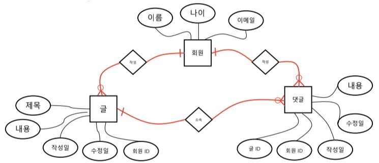

# SQL 심화 2

## 정규화 Nomalization

> RDB 설계 단계에서 중복을 최소화하여 데이터를 구조화하는 과정
> 
> 구조화란 크고, 제대로 조직되지 않은 테이블들과 관계들을 작고 잘 조직된 테이블과 관계들로 나누는 것

### 정규화 목적

> 데이터를 쉽게 관리하기 위해!

- 하나의 데이터를 무조건 한 곳에만 위치하도록

- 테이블 간의 관계는 키를 통해 형성

- 데이터를 변경하더라도 한 곳만 변경하는 구조 확립

### 제 1정규화

- 데이터베이스의 각 필드에는 하나의 값만 저장해야 함

- 유사하게 정보를 저장하는 두개의 필드가 있어서는 안됨
  - 반복되는 부분을 찾아 테이블을 분할하고 기본키가 될 필드를 작성해줘야 함

### 제 2정규화

- 키 값을 이용해 데이터를 특정지을 수 있는 것(함수 종속성)을 찾아 테이블 분할

### 제 3정규화

- 기본 키 이외의 부분에서 중복이 없는 지를 조사하여 테이블 분할

 

## Data Modeling

> 데이터베이스 시스템을 시각적으로 표현하는 프로세스
> 
> 데이터 유형, 데이터간의 관계 및 분석 등을 통해 비즈니스 요구사항을 만들어 낼 수 있도록 도움

### ER(Entity-Relationship) Diagram

: 다이어그램을 사용하여 데이터베이스의 Entity간의 관계를 나타내는 방법

- 구성요소

  - 사각형 : Entity = Table

  - 원 : Attribute = Fied

  - 마름모 : Relation = PK, FK

### Relationship 표현 방법

- Cardinality

  - 1:1 관계 : 선 하나로 표현, ex) 각 회원은 글 하나만 쓸 수 있다.

  - N:1 관계 : 선 하나에서 분기되는 선 표현(까마귀발), ex) 글의 저자는 한명, 각 회원은 여러 글 작성

  - N:M 관계 : 까마귀발 양쪽으로 표현, ex) 공동저자

- Optionality : 필수 & 선택

  - 1:N 관계라면 회원은 필수 & 글은 선택 (각자의 입장에서 생각!)
  - 필수인 곳에 파이프라인, 선택인 곳에 동그라미 표시

### 데이터 모델링의 중요성
- 데이터베이스 소프트웨어 개발 오류 감소

- 데이터베이스 설계 및 생성 속도와 효율성 촉진

- 조직 전체에서 데이터 문서화 및 시스템 설계의 일관성 조성

- 데이터 엔지니어와 비즈니스 팀 간의 커뮤니케이션 촉진

### ERD 작성 사이트
- https://app.diagrams.net/

- https://www.erdcloud.com/
