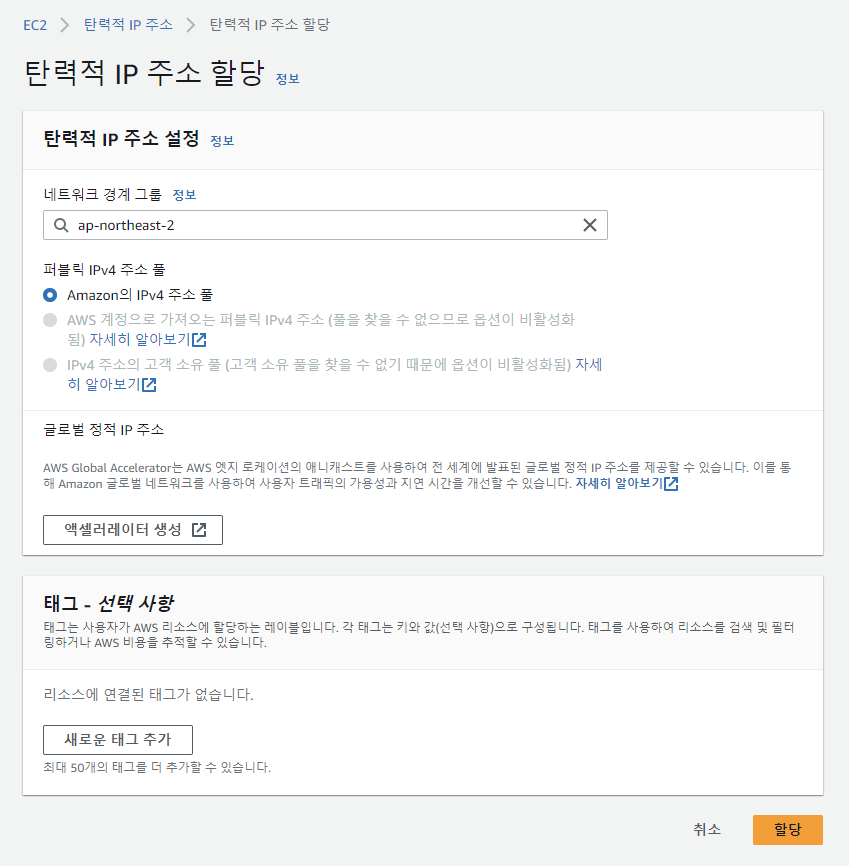
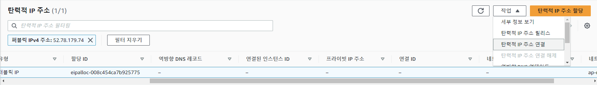
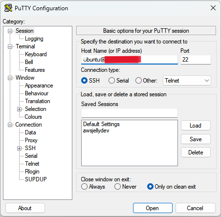
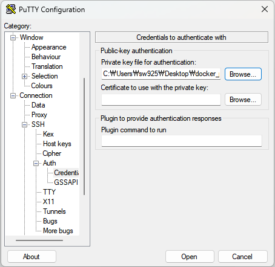

# Amazon EC2

## EC2 서버란?

> Amazon Elastic Compute Cloud

- AWS에서 제공하는 클라우드 컴퓨팅 서비스

- 컴퓨팅 요구량에 따라 대여하는 컴퓨터의 성능, 용량 등을 탄력적으로 조절 가능

- 사용한 만큼 비용을 지불

 

## 서버 구축(Docker 실습용)

> AMI를 토대로 인스턴스를 생성하는 것(=컴퓨터를 대여하는 것)
> 
> AMI(Amazon Machine Image)는 인스턴스를 시작하는 데 필요한 운영체제, 애플리케이션 및 에플리케이션 서버가 포함된 템플릿

1. region 선택 : 서울

2. 인스턴스 시작

3. AMI 선택 : Ubuntu 20.04 선택

4. 인스턴스 유형 선택

    - CPU, 메모리, 스토리지, 네트워크킹 용량 등의 조합에 따른 다양한 유형이 있음

    - free tier에서 사용 가능한 t2.micro 선택

5. 스토리지 구성 : 최대 GB로 설정

6. 키페어 생성

    - '새 키페어 생성'을 누르면 키페어를 생성하는 modal popup

    - 이름을 설정하고 '.ppk' 형식으로 생성
    
    - windows에서 리눅스 인스턴스에 접속하기 위해서는 PuTTY를 사용해야하며 PuTTY는 ppk형식의 파일만 읽을 수 있음

7. 인스턴스 시작

8. 탄력적 IP 주소 할당

    - 인스턴스의 public IP는 동적인 주소이기 때문에 고정적인 공인 IP 주소를 할당(=탄력적 IP 주소 할당)해야 함

    - 탄력적 IP 주소 tab 이동

    - '탄력적 IP 주소 할당' 클릭 후 아래의 설정대로 할당
    
        
    
    - 나의 인스턴스에 탄력적 IP 주소 연결
    
        

    - 고정 IP를 부여하지 않으며 과금되므로 주의!!

 

## EC2 서버 접속

> [AWS 가이드](https://docs.aws.amazon.com/ko_kr/AWSEC2/latest/UserGuide/putty.html) 참고

1. 로컬 컴퓨터에 PuTTY 설치

2. PuTTY 실행

3. Host Name & Port번호 & SSH

    

    - Host Name : 'instance-user-name@instance-public-dns-name'

    - Port 번호 22 확인

    - 연결 유형 SSH 선택

4. 키페어 인증

    

    - Category - Connection - SSH - Auth - Credentials로 이동

    - Private key file for authentication에서 .ppk 파일 열기

5. Session save

    - Category - Session으로 다시 이동 후 Saved Sessions에 이름을 정하여 작성
    
    - Save하면 매번 모든 설정을 다시 작성할 필요 없이 이전 세션으로 쉽게 서버를 열 수 있음

6. Open

7. PuTTY에서 연결하려는 호스트를 신뢰할 수 있는지 묻는 보안 알림 accept