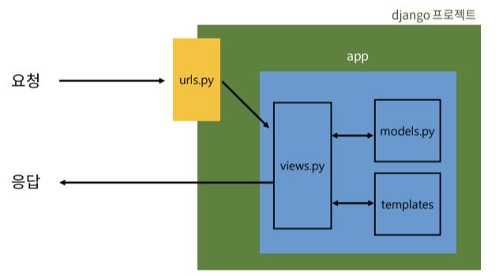

# Design pattern

## 프로젝트와 앱

- django project
  - 애플리케이션의 집합

  - DB 설정, URL 연결, 전체 앱 설정 등을 처리

- django application
  - 독립적으로 작동하는 기능 단위 모듈

  - 각자 특정한 기능을 담당하며 다른 앱들과 함께 하나의 프로젝트를 구성

  - MTV 패턴에 해당하는 파일 및 폴더를 담당

### 앱의 생성과 등록

- 앱 생성
  ```bash
  $ python manage.py startapp articles
  # 앱의 이름은 복수형 권장
  ```

- 앱 등록 : 프로젝트 파일의 settings.py에 등록(반드시 생성 후 등록하기)
  ```python
  # Application definition

  INSTALLED_APPS = [
      # 앱 등록 권장 순서
      # 1. local app
      'articles',

      # 2. 3rd party app(설치를 통해 추가하는 앱)

      # 3. 기본 django app
      'django.contrib.admin',
      'django.contrib.auth',
      'django.contrib.contenttypes',
      'django.contrib.sessions',
      'django.contrib.messages',
      'django.contrib.staticfiles',
  ]
  ```

<br>

## 디자인 패턴

> 소프트웨어 설계에서 발생하는 문제를 해결하기 위한 일반적인 해결책
> 
> => 공통적인 문제를 해결하는데 쓰이는 형식화된 관행

### MVC 디자인 패턴
> Model - View - Controller

- 애플리케이션을 구조화하는 대표적인 패턴

- 데이터, 사용자 인터페이스, 비즈니스 로직으로 분리

- 시각적 요소와 뒤에서 실행되는 로직을 서로 영향 없도록 하여 독립적이고 유지보수가 쉽도록 함


### MTV 디자인 패턴
> Model - Template - View



- django에서 사용하는 디자인패턴

- 기존 MVC와 패턴은 동일하며 명칭만 다름
  - MVC의 View → Template
  - MVC의 Controller → View

1. 프로젝트의 구조
    - settings.py : 프로젝트의 모든 설정 관리

    - urls.py : URL과 이에 해당하는 적절한 views를 연결

    - `__init__.py` : 해당 폴더를 패키지로 인식하도록 설정

    - asgi.py : 비동기식 웹 서버와의 연결 관련 설정

    - wsgi.py : 웹 서버와의 연결 관련 설정

    - manage.py : Django 프로젝트와 다양한 방법으로 상호작용하는 커맨드라인 유틸리티

2. 앱의 구조
    - admin.py : 관리자용 페이지 설정

    - models.py : DB와 관련된 Model을 정의(MTV 패턴의 M)

    - views.py : HTTP 요청을 처리하고 해당 요청에 대한 응답을 반환(NTV 패턴의 V)

    - apps.py : 앱의 정보가 작성된 곳

    - tests.py : 프로젝트 테스트 코드를 작성하는 곳

<br>

## 요청과 응답

> 데이터 흐름에 따라 URLs → View → Template 순으로 코드 작성!!

### 1. URLs
```python
from django.contrib import admin
from django.urls import path
# 현재 위치로 articles라는 패키지(앱)에서 views라는 모듈을 가져와야함
from articles import views

urlpatterns = [
    # admin은 기본적으로 세팅됨
    path('admin/', admin.site.urls),
    # 요청을 받은 객체(문자열 형태 + /)와 호출할 함수(콜백함수) 작성
    path('articles/', views.index),
]
```
: http://128.0.0.1:8000/`articles/`로 요청이 왔을 때 views 모듈의 index 뷰 함수를 호출한다는 의미

### 2. View
```python
from django.shortcuts import render

# 특정 기능을 수행하는 view 함수를 생성
# 모든 view 함수는 첫번째 인자로 요청 객체(request)를 필수적으로 받는다
# 'index.html'은 template name이자 templates 이후의 경로, 문자열 형태로 작성
def index(request):
    return render(request, 'index.html')
```
: 특정 경로에 있는 template과 request 객체를 결합해 응답 객체를 반환하는 index 뷰 함수 정의

- render 함수
  ```python
  render(request, template_name, context)
  #      요청객체, 템플릿 이름의 경로, 템플릿에서 사용할 데이터(딕셔너리 타입)
  ```
  - 주어진 탬플릿을 주어진 컨텍스트 데이터와 결합하고 렌더링된 텍스트와 함께 HttpResponse(응답) 객체를 반환

  - 한마디로 template + data 자료(user에게 보여질 것)를 반환하는 것

### 3. Template
- 요청을 받은 앱폴더에 templates 폴더를 만들고 그 안에 템플릿 페이지 작성

- 폴더명은 반드시 `templates`이어야 함