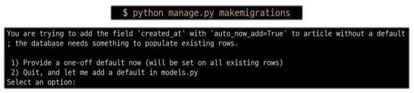

# Django Model

## django Model

> DB의 테이블을 정의(구조 설계)하고 데이터를 조작할 수 있는 기능들을 제공

- SQLite
  - 오픈소스 RDBMS 중 하나이며 django의 기본 DB로 사용됨

  - DB가 파일로 존재하며 가볍고 호환성이 좋음

### model 클래스로 table 생성
```python
# app의 models.py

from django.db import models

class TODO(models.Model):
  #  필드명       데이터 타입     제약조건
    content = models.CharField(max_length=80)
    completed = models.BooleanField(default=False)
    priority = models.IntegerField(default=3)
    created_at = models.DateField(auto_now_add=True)
    deadline = models.DateField(null=True)
```
1. django.db.models 모듈의 Model이라는 부모 클래스를 상속받아 작성(model 기능 관련된 모든 설정이 담긴 클래스)

2. 클래스 변수명 : 테이블의 각 필드 이름

3. model Field 클래스 : 테이블의 데이터 타입, [model Field 클래스의 종류](https://docs.djangoproject.com/en/3.2/ref/models/fields/)
    - CharField() : 길이 제한이 있는 문자열의 타입(max_length를 필수인자로 사용)

    - TextField() : 글자수 제한 X

    - DateTimeField() : 날짜와 시간 넣을 때 사용
      - 선택인자 auto_now : 데이터가 저장될 때마다 자동으로 현재 날짜시간 저장

      - 선택인자 auto_now_add : 데이터가 처음 생성될 때만 자동으로 현재 날짜시간 저장

4. model Field 클래스의 인자 : 테이블 필드의 제약조건 관련 설정, [필드 옵션 종류](https://docs.djangoproject.com/en/3.2/ref/models/fields/)

<br>

## Migrations

> model 클래스의 변경사항들을 DB에 최종 반영하는 방법

### 과정
1. model class에 table 작성, field 추가, 수정 등의 변경사항 저장(설계도 초안)

2. makemigrations
    - `python manage.py makemigrations` 명령어 사용

    - model class 기반으로 migrations file(최종 설계도) 작성

3. migrate
    - `python manage.py migrate` 명령어 사용

    - 만들어진 설계도를 DB에 전달하여 반영

    - DB에 전달되는 과정에서 migrations file이 SQL문으로 해석 후 전달됨

    - 첫 migrate 시 Django 프로젝트가 동작하기 위해 작성되어 있는 기본 내장 app들의 migration file들이 함께 전달되기 때문에 출력 내용이 많음


### 추가 모델 필드 작성
```python
# app의 models.py
from django.db import models

class TODO(models.Model):
  #  필드명       데이터 타입     제약조건
    content = models.CharField(max_length=80)
    completed = models.BooleanField(default=False)
    priority = models.IntegerField(default=3)
    created_at = models.DateField(auto_now_add=True)
    deadline = models.DateField(null=True)
    category = models.CharField(max_length=20, default='기타') # 필드 추가
```

- 기존 테이블이 존재하는 경우 DB는 기본적으로 빈값을 허용하지 않기 때문에 필드를 추가할 때 필드의 기본값 설정이 필요

- 1번은 직접 기본값을 입력하는 방법
  - 1번 선택 시 날짜 데이터의 경우 django가 제안하는 기본값(timezone.now) 사용 권장(Enter)

- 2번은 현재 대화에서 나간 후 models.py에 기본값 관련 설정을 하는 방법

- 추가가 완료되면 두 번째 migration file이 생성됨

- 이는 git의 commit과 같이 추후 문제 발생 시 복구용으로 사용할 수 있음


### Migrations 기타 명령어
- `python manage.py showmigrations`
  - migrations 파일들이 migrate되었는지 여부 확인

  - [X] 표시가 있으면 migrate가 완료되었음을 의미

- `python manage.py sqlmigrate [app_name] [migration_file_number]`
  - ex) `python manage.py sqlmigrate TODO 0001`

  - 해당 migrations file이 SQL문으로 어떻게 해석되어 DB에 전달되는지 확인


<br>

## admin
### Automatic admin interface

> django는 추가 설치 및 설정 없이 자동으로 관리자 인터페이스를 제공(데이터 관련 테스트 매우 유용)

- admin 계정 생성
  - `python manage.py createsuperuser` 명령어 사용

  - email은 선택사항

  - password 생성 시 보안 상 터미널에 출력되지 않음([참고자료](https://d2.naver.com/helloworld/318732))

  - 생성 후 DB의 auth_user table에서 계정 확인!

- admin에 모델 클래스 등록
  ```python
  # admin.py

  from django.contrib import admin
  # 현재 위치의 models에서 TODO를 import
  from .models import TODO

  # admin site에 TODO를 등록
  admin.site.register(TODO)
  ```
  - admin.py에 등록하지 않으면 admin site에서 확인할 수 없음

  - 등록 후 '서버/admin/'에서 확인 및 CRUD test 가능

  - CRUD 시 db.sqpite3에 반영된 것 확인 가능


<br>

## 참고

### DB 초기화
1. migration 파일 삭제(폴더를 지우지 않도록 주의!!!)

2. db.sqlite3 파일 삭제


### 언어와 시간 변경
- settings.py에서 변경 가능

- 언어 : LANGUAGE_CODE = 'en-us' → 'ko-kr'(공식적으로 영어를 한국어로 번역하여 출력)

- 시간 : TIME_ZONE = 'UTC' → 'Asia/Seoul'
