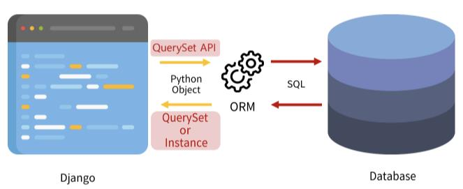

# ORM

> ORM(Object-Relational-Mapping)
> 
> 객체 지향 프로그래밍 언어를 사용하여 호환되지 않는 유형의 시스템 간에 데이터를 변환하는 프로그래밍 기술

## QuerySet API

> ORM에서 데이터를 검색, 필터링, 정렬 및 그룹화하는데 사용하는 도구
> 
> API를 사용하여 SQL이 아닌 Python 코드로 데이터를 처리

### QuerySet API 구문

`Model_class.objects.Queryset_API`

ex) Article.objects.all()

### QuerySet



- python 코드가 ORM에 의해 SQL로 변환되어 DB에 전달

- DB의 응답 데이터를 ORM이 QuerySet이라는 자료형태로 변환하여 우리에게 전달

- QuerySet
  - 순회 가능한 데이터로써 1개 이상의 데이터를 불러와 사용 가능

  - 단, 데이터 베이스가 단일한 객체를 반환할 때는 QuerySet이 아닌 모델(class)의 인스턴스로 반환됨


<br>

## ORM CREATE

### Django shell

: django 환경 안에서 실행되는 python shell

- 사용을 위해 `pip install ipython, django-extensions`

- apps에 저장
  ```python
  # settings.py
  INSTALLED_APPS = [
    'django_extensions',
    ....,
  ]
  ```

- requirements.txt Update : `pip freeze > requirements.txt`

### 데이터 객체 생성 3가지 방법
1. instance 선언 - 각각 기술 - save
    ```shell
    article = Article()
    article.title = 'first'
    article.content = 'django!'

    article.save()
    ```
    - save 메서드롤 호출하여 DB에 저장하며, 저장 후 id값이 생성됨

2. instance 선언하며 값 지정 - save
    ```shell
    article = Article(title='second', contenet='django!')
    article.save()
    ```

3. create 메서드
    ```shell
    Article.objects.create(title='third', content='django!')
    <Article: Article object (3)>
    ```
    - 생성과 동시에 자동으로 저장되며 생성된 데이터를 반환


<br>

## ORM READ

- all()
  - 전체 데이터 조회

  - `Newspaper.objects.all()`의 형태

- get()
  - __단일__ 데이터 조회(pk와 같이 고유성을 보장하는 조회에서 사용해야 함!!)

  - 찾는 객체가 없으면 DoesNotExist 예외, 찾는 객체가 둘 이상이면 MultipleObjectsRturned 예외가 발생

  - `Newspaper.objects.get(조건)`의 형태, ex) `Newspaper.objects.get(pk=1)`

- QuerySet API 관련 공식문서

  - https://docs.djangoproject.com/en/3.2/ref/models/querysets/

  - 특정 조건의 데이터를 조회하는 filter, 조회 조건을 설정하는 Field lookups 외에도 다양한 API 존재


<br>

## ORM UPDATE
변수에 인스턴스 할당 - 값 변경 - 저장
```python
news = Newspaper.objects.get(pk=1)
news.title = 'hello'
news.save()
```


<br>

## ORM CREATE
변수에 인스턴스 할당 - delete 메서드로 삭제
```python
news = Newspaper.objects.get(pk=1)
news.delete()
# delete 시 삭제된 데이터 반환됨
```


<br>

## 실습
```python
# 1. pk 필드가 1인 단일 데이터의 journalist 필드 조회
Newspaper.objects.get(pk=1).journalist

# 2. journalist 필드가 Laney Mccullough인 데이터 개수 조회
Newspaper.objects.filter(journalist='Laney Mccullough').count()

# 3. pk 필드 기준 내림차순으로 정렬한 모든 데이터 조회
Newspaper.objects.order_by('-pk')

# 4. created_at 필드 기준 내림차순으로 정렬한 모든 데이터 조회
Newspaper.objects.order_by('-created_at')

# 5. journalist 필드가 Britney를 포함하는 데이터 개수 조회
Newspaper.objects.filter(journalist__contains='Britney').count()

# 6. journalist 필드가 ['Britney Mahoney', 'Arianna Walls', 'Carl Short']에 속하는 데이터 개수 조회
Newspaper.objects.filter(journalist__in=['Britney Mahoney', 'Arianna Walls', 'Carl Short']).count()

# 7. created_at 필드가 2000-01-01 이후 데이터 개수 조회
Newspaper.objects.filter(created_at__date__gte='2000-01-01').count()

"""
8. 마지막 단일 데이터의 title, content, journalist 필드를 조회하고 아래와 같은 형식으로 출력
답
title : Teach father within million consumer baby its.
content : Then member effort want site. Radio represent yard bag fine. Congress movie ten along.
Hand receive agree science present main. Other member every.
journalist : Laney Mccullough
"""
last = Newspaper.objects.latest()
print('title :', last.title)
print('content :', last.content)
print('journalist :', last.journalist)
```
