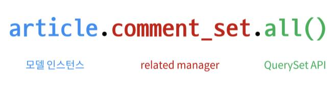

# Many to one relationsships 01

## 모델 관계 설정

- N : 1 관계는 한 테이블의 0개 이상의 레코드가 다른 테이블의 레코드 한 개와 관련된 관계를 말함

- Comment(댓글) - Article(글)을 N : 1 관계의 예로 들 수 있음

- ForeignKey() : django에서 N 대 1 관계 설정을 위한 모델 필드

### Model 정의
```python
# articles/models.py
class Article(models.Model):
    title = models.CharField(max_length=10)
    content = models.TextField()
    created_at = models.DateTimeField(auto_now_add=True)
    updated_at = models.DateTimeField(auto_now=True)


class Comment(models.Model):
  # 외래키 필드는 참조하는 모델 클래스 이름의 단수형으로 작성하는 것을 권장
    article = models.ForeignKey(Article, on_delete=models.CASCADE)
    content = models.CharField(max_length=200)
    created_at = models.DateTimeField(auto_now_add=True)
    updated_at = models.DateTimeField(auto_now=True)
```
- Comment의 article field는 DB에 'article_id'로 저장됨

- 위치와 관계 없이 ForeignKey field는 마지막에 생성됨

- ForeignKey(to, on_delete)
  - to : 참조하는 모델 class의 이름

  - on_delete : 참조하는 모델 class가 삭제될 때 연결된 하위 객체의 동작을 결정
    - CASCADE : 부모 객체(참조된 객체)가 삭제됐을 때 이를 참조하는 객체도 모두 삭제

    - PROTECT, RESTRICT, SET_NULL 등 다양한 옵션 존재([공식문서 참고](https://docs.djangoproject.com/en/3.2/ref/models/fields/#arguments))


<br>

## 역참조

> 나를 참조하는 테이블을 역으로 내가 참조하는 것(= N : 1 관계에서 1이 N을 참조하는 상황)

### related manager


- N : 1 또는 M : N 관계에서 역참조 시에 사용하는 manager

- 위의 예시를 가져오면 Article 클래스에는 Comment와의 어떠한 관계도 작성되어있지 않기 때문에 이 manager가 필요

- related manager의 이름은 참조할 `모델명_set`의 규칙으로 만들어짐


<br>

## 댓글 기능 구현 실습

- form 정의
  ```python
  # articles/forms.py
  from django import forms
  from .models import Article, Comment

  class ArticleForm(forms.ModelForm):
      class Meta:
          model = Article
          fields = '__all__'


  class CommentForm(forms.ModelForm):
      class Meta:
          model = Comment
          fields = ('content',)
  ```
  - 댓글의 FK값은 사용자가 입력하거나 사용자에게 보여지지 않으므로 Form에는 content만 필요

  - FK는 view함수 내에서 별도로 처리

### Comment CREATE

```python
# urls.py
urlpatterns = [
    ...
    path('<int:article_pk>/comments/', views.comment_create, name='comment_create'),
]
```
```python
# views.py
from .models import Article
from .forms import CommentForm

def comment_create(request, article_pk):
    article = Article.objects.get(pk=article_pk)
    comment_form = CommentForm(request.POST)
    if comment_form.is_valid():
        comment = comment_form.save(commit=False)
        comment.article = article
        comment.save()
        return redirect('articles:detail', article_pk)
    comments = article.comment_set.all()
    context = {
        'article': article,
        'comment_form': comment_form,
        'comments': comments,
    }
    return render(request, 'articles/detail.html', context)
```
- save함수는 'commit=True'가 기본값으로 False로 변경 시 임시저장 상태로 DB에 반영되지 않고 인스턴스만 반환

- CommentForm에는 content 필드의 input만 있으므로 FK값인 article을 지정해줘야 함

- 이때 'save(commit=False)'를 이용해 DB에는 저장하지 않은 상태로 인스턴스를 생성하여 생성한 인스턴스에 article값을 부여하고 저장!!

```html
<!-- template -->
...
<form action="" method="POST">
  
  {{ comment_form }}
  <input type="submit">
</form>
```

### Comment READ
```python
# views.py

def detail(request, pk):
    article = Article.objects.get(pk=pk)
    comment_form = CommentForm()
    comments = article.comment_set.all()
    context = {
        'article': article,
        'comment_form': comment_form,
        'comments': comments,
    }
    return render(request, 'articles/detail.html', context)
```
- detail에 댓글 조회 코드 추가

```html
<!-- template -->
<h4>댓글 {{ article.comment_set.count }}개</h4>
<ul>
  
    <li>
      {{ comment.content }}
      <form action="" method="POST">
        
        <input type="submit" value="삭제">
      </form>
    </li>
  
</ul>
```
- `{{ article.comment_set.count }}` : count 함수를 사용하여 개수 출력 가능


### Comment DELETE
```python
# urls.py

urlpatterns = [
    ...,
    path('<int:article_pk>/comments/<int:comment_pk>/delete/', views.comment_delete, name='comment_delete'),
]
```
- article pk와 comment pk 두 개가 필요함

```python
# views.py

def comment_delete(request, article_pk, comment_pk):
    comment = Comment.objects.get(pk=comment_pk)
    comment.delete()
    return redirect('articles:detail', article_pk)
```
- comment pk를 이용해 해당 댓글을 삭제하고 article pk를 detail url로 함께 보내줌

<br>

## 참고

### 댓글 개수 출력
1. QuerysetAPI의 count() : `{{ article.comment_set.count }}`

2. DTL filter의 length : `{{ comments|length }}`


### 댓글이 없는 경우 대체 컨텐츠 출력
- DTL tag의 for empty
  ```html
  <h4>댓글 {{ article.comment_set.count }}개</h4>
  <ul>
    
      <li>
        {{ comment.content }}
        <form action="" method="POST">
          
          <input type="submit" value="삭제">
        </form>
      </li>
    
    <p>댓글이 없습니다.</p>
    
  </ul>
  ```
