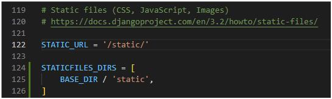
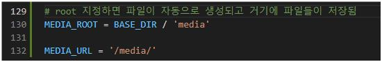
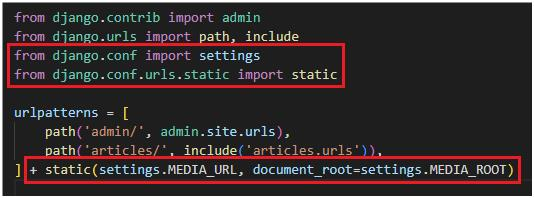

# Static files

> 서버 측에서 변경되지 않고 고정적으로 제공되는 파일(이미지, JS, CSS 등)

- 웹 서버의 기본 동작은 URL에 있는 자원을 HTTP request(요청) 받아서 HTTP response(요청)을 처리하고 제공하는 것

- static file도 마찬가지로 이 정적 파일을 제공하기 위한 URL이 있어야 함!!

## Static files 제공하기
### static file의 경로

- 기본 경로 : 'app/static/'으로 template과 동일, 각 app에 'static/app_name'의 폴더 생성(경로 지정 편리함을 위해)

- 추가 경로 : 필요 시 template에 추가 경로를 작성하는 것과 동일하게 설정 가능


### static file의 URL 제공
```html
<!-- articles/index.html -->


...


```
- `` : html파일에서 static tag를 사용 할 수 있도록 불러오는 역할, 템플릿 상단에 작성

- `` : static tag로 static file의 경로를 작성하여 불러옴

- 이렇게 불러온 static file의 URL은 아래와 같음
  


<br>

## Media Files

> static file에 속하나 사용자가 웹에서 업로드하는 정적 파일을 의미

### media file 사용 준비사항
1. settings.py 설정

    
    - MEDIA_ROOT : media file들이 위치하는 디렉토리의 절대 경로(기본적으로 세팅되어 있는 STATIC_ROOT와 다르게 직접 추가 설정 필요)

    - MEDIA_URL : MEDIA_ROOT에서 제공되는 미디어 파일에 대한 주소를 생성(STATIC_URL과 동일한 역할)

    - media의 추가 경로 설정은 ImageField의 upload_to argument로 설정 가능(하단 참고 확인)

2. 작성한 MEDIA_ROOT와 MEDIA_URL에 대한 url지정

    
    - 업로드 된 파일의 URL이 settings.MEDIA_URL이 됨

    - 위 URL을 통해 참조하는 파일의 실제 위치가 settings.MEDIA_ROOT가 됨


<br>

## 이미지 업로드 및 제공

### 이미지 업로드
1. model에 image field 추가

    
    - 사용하려는 model에 `image = models.ImageField(blank=True, upload_to='images/')` 작성

    - ImageField() : 이미지 업로드에 사용하는 모델필드로 이미지가 직접 저장되지 않고 '이미지 파일의 경로 문자열'이 DB에 저장됨

    - 이미지를 선택사항으로 하기 위해 'blank=True'속성 작성(빈 문자열 저장)

    - 기존 필드 사이에 작성해도 실제 테이블 생성 시에는 가장 뒤에 추가됨

2. pillow install
    - `$ pip install Pillow` : ImageField를 사용하려면 반드시 Pillow 라이브러리 필요

3. form 요소에 enctype 속성 추가
    ```html
    <!-- articles/create.html -->
    <form action="" method="POST" enctype="multipart/form-data">
      
      {{ form.as_p }}
      <input type="submit">
    </form>
    ```
    - `enctype="multipart/form-data"` 추가

    - form은 기본적으로 text만 전송 가능하므로 encoding type 변경 필요

4. view함수에서 업로드 파일에 대한 추가 코드 작성
    ```python
    def create(request):
    if request.method == 'POST':
        form = ArticleForm(request.POST, request.FILES)
    ...
    ```
    - `request.FILES` 추가(view 함수에서 file인식)

### 업로드 이미지 제공
```html
<!-- articles/detail.html -->

  

  

```
- `article.image` : 업로드 파일의 파일 이름

- `article.image.url` : 업로드 파일의 경로

- 이미지를 업로드 하지 않은 게시물의 출력 에러를 방지하기 위해 if 문 적용


### 이미지 수정
- 이미지 업로드와 마찬가지로 form에 enctype, view함수에 request.FILES 작성


<br>

## 참고
### uload_to
```python
# 1
image = models.ImageField(blank=True, upload_to='images/')

# 2
image = models.ImageField(blank=True, upload_to='%Y/%m/%d/')

# 3 user 관리 시
def articles_image_path(instance, filename):
    return f'images/{instance.user.username}/{filename}'

image = models.ImageField(blank=True, upload_to='articles_image_path')
```
- ImageField()의 upload_to 인자를 사용하여 미디어 파일 추가 경로 설정 가능
