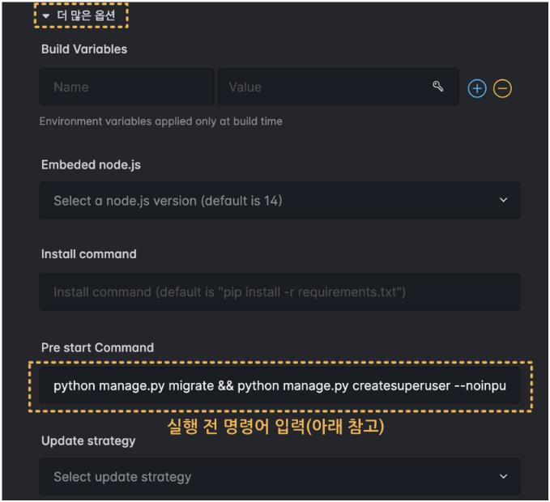
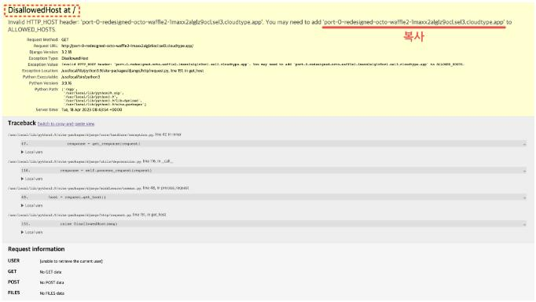

# 클라우드타입 활용 django 웹 서비스 배포

## 환경 변수를 이용한 SECRET KEY 관리

### 환경변수

- 운영체제 단위에서 활용되는 변수로 os상의 모든 프로세스(프로그램)에서 전역적으로 사용되는 변수

- 외부에 공개되면 안되는 값의 노출을 막거나 배포 환경에서 필요한 값을 할당하기 위해 사용됨

- os 환경변수 조회 : 터미널에 `set` 입력

- python 환경변수 조회
  ```python
  import os

  # 전체 목록 조회
  print(os.environ)

  # 특정 환경변수 조회
  print(os.getenv('환경변수 키'))
  ```

### python-dotenv를 활용한 환경변수 관리

- .env 파일에서 key-value를 읽어 프로그램 환경변수로 설정해주는 라이브러리

- 중요한 데이터를 환경변수 형태로 관리하여 외부에 노출되는 것을 막을 수 있음

- 사용법

  1. 패키지 설치
      ```bash
      $ pip install python-dotenv
      ```

  2. manage.py와 동일한 경로에 .env 파일 생성

  3. .env 파일에 key-value 작성([SECRET_KEY 생성기](https://djecrety.ir/))
      ```python
      # .env

      SECRET_KEY = '생성기를 통해 생성한 값'
      ```
  
  4. settings.py에 SECRET_KEY 할당 코드 수정
      ```python
      # 기존
      SECRET_KEY = '기존 SECRET_KEY'

      # ------------------------

      # 수정
      import os
      from dotenv import load_dotenv

      # .env 파일의 key-value를 프로그램 환경 변수에 등록
      load_dotenv()

      # 환경 변수에서 key가 SECRET_KEY인 value 불러오기
      SECRET_KEY = os.getenv('SECRET_KEY')
      ```
  
  5. .gitignore에 .env 작성(gitignore생성기로 생성 시 작성되어 있음)

<br>

## 클라우드타입을 이용한 배포

1. 프로젝트 생성 클릭 후 배포할 저장소 선택

2. 언어/프레임웍 선택 : 'Python Django'

3. Environment variables

    
    ```
    DJANGO_SUPERUSER_USERNAME : 관리자 아이디
    DJANGO_SUPERUSER_EMAIL : 관리자 이메일
    DJANGO_SUPERUSER_PASSWORD : 관리자 비밀번호
    ```

4. Pre start Command

    
    ```bash
    # Pre start Command 입력 커맨드
    python manage.py migrate && python manage.py createsuperuser --noinput
    ```
    - python manage.py migrate : DB 마이그레이트

    - python manage.py createsuperuser --noinput : 환경 변수를 활용하여 관리자 계정 생성

5. 리전 선택 : 'Seoul-Korea'

6. 배포!


### DisallowedHost


```python
# settings.py

ALLOWED_HOSTS = ['복사한 주소 붙여넣기']
```
- git add, commit, push 후 재배포

- ALOOWED_HOSTS : HTTP Host header 공격을 방지하기 위해 django 프로젝트 서비스의 접속을 허용하는 호스트/도메인 문자열 목록 지정, 기본적으로 localhost과 127.0.0.1 허용