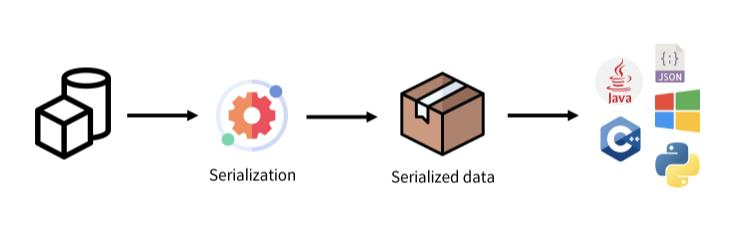

# Django rest framework

## HTTP Request Methods

> resource(자원)에 대한 행위(수행하고자 하는 동작)를 정의, HTTP verbs라고도 함

- GET : 서버의 리소스의 표현을 요청(조회)

- POST : 데이터를 지정된 리소스에 제출, 서버의 상태를 변경(생성)

- PUT : 요청한 주소의 리소스를 수정

- DELETE : 지정도니 리소스 삭제

### HTTP response status codes

: 현재 상태에 따라 다섯개의 그룹으로 나뉨
1. 100 ~ 199 : Informational responses

2. 200 ~ 299 : Successful responses

3. 300 ~ 399 : Redirection messages

4. 400 ~ 499 : Client error responses

5. 500 ~ 599 : Server error responses

<br>

## REST API

### API(Application Programming Interface)

- 소프트웨어 인터페이스로 정의 및 프로토콜 집합을 사용하여 두 소프트웨어 구성요소가 서로 요청과 응답으로 통신할 수 있도록하는 메커니즘

- ex) 카카오맵 api를 가져와 쓰면 내가 지도를 직접 개발하지 않고도 손쉽게 카카오맵 사용 가능


### Web API

- 웹 서버와 웹 브라우저 간의 API


### REST API(Repressentational State Tranfer)

- REST는 **자원을 정의**하고 자원에 대한 **주소를 지정**하는 전반적인 방법을 서술

- 클라이언트가 서버 데이터에 엑세스하는 데 사용할 수 있는 함수집합을 정의

- URL을 통해 자원을 식별 → HTTP Methods(GET, POST, PUT, DELETE 등)에 의해 자원의 행위 결정 → 행위에 따른 결과물을 JSON형식으로 제공

- REST API는 작동 방식에 대한 조건을 부과하는 소프트웨어 아키텍쳐!

- 같은 url이더라도 API가 담고 있는 method에 따라 작동 방식이 달라짐

- 클라이언트와 서버는 HTTP를 사용하여 데이터를 교환

<br>

## Response JSON

- 기존에 서버가 html 페이지를 응답한 것 처럼 JSON 파일로 응답할 수 있음

- 서버가 JSON으로 응답 시 프론트엔드와 백엔드가 분리될 수 있으며 이를 위해 REST frameword 라이브러리 필요

### Django REST framework(DRF)

> Django에서 Restful API 서버를 쉽게 구축할 수 있도록 도와주는 오픈소스 라이브러리

- 설치 : `$ pip install djangorestframework`

- app 등록 : settings.py의 INSTALLED_APPS에 'rest_framework' 추가

- python에서 json 응답 받아보기
  ```python
  import requests
  from pprint import pprint

  response = requests.get('http://127.0.0.1:8000/api/v1/articles/')
  # json을 python 타입으로 변환
  result = response.json()

  print(type(result))
  pprint(result)
  pprint(result[0].get('title'))
  ```

### Serialization

> 직렬화 : 여러 시스템에서 활용하기 위해 데이터 구조나 객체 상태를 나중에 재구성할 수 있는 포멧으로 변환하는 과정



<br>

## DRF - Single Model

: 단일 모델의 data를 Serialization하여 JSON으로 변환하는 방법

[Postman](https://www.postman.com/) 활용
  - API를 구축하고 사용하기 위한 플랫폼

  - API를 빠르게 만들 수 있는 여러 도구 및 기능 제공

### ModelSerializer

```python
# articles/serializers.py

from rest_framework import serializers
from .models import Article

# 단일 데이터 조회, 삭제, 수정에 사용
class ArticleSerializer(serializers.ModelSerializer):
    class Meta:
        model = Article
        fields = ('id', 'title', 'content',)

# 여러 개의 articles조회, 생성에 사용
class ArticleListSerializer(serializers.ModelSerializer):
    class Meta:
        model = Article
        fields = ('id', 'title',)
```
- modelForm과 같은 형태로 개발됨

- Model 정보에 맞춰 자동으로 field 생성

- serializer에 대한 유효성 검사기 자동으로 생성

- serializers.py의 위치나 파일명은 자유롭게 작성 가능


### CRUD

- 전체 게시글 조회와 게시글 생성
  ```python
  # articles/urls.py

  urlpatterns = [
      path('articles/', views.articles_list),
  ]
  ```
  ```python
  # articles/views.py

  from .serializers import ArticleSerializer, ArticleListSerializer
  from rest_framework.response import Response  # JSON으로 응답하기위해 import
  from rest_framework import status    # HTTP response status를 나타내기위해 import
  from rest_framework.decorators import api_view
  from .models import Article

  @api_view(['POST', 'GET'])
  def articles_list(request):
    # 생성
      if request.method == 'POST':   # 사용자로부터 입력받은 데이터를 인자로 넣어줌
          serializer = ArticleSerializer(data=request.data)
          if serializer.is_valid():
              serializer.save()
              # serialize한 data와 HTTP response status를 Response로 return
              return Response(serializer.data, status=status.HTTP_201_CREATED)
          # 데이터가 유효하지 않은 겨우 errors와 400 return
          return Response(serializer.errors, status=status.HTTP_400_BAD_REQUEST)
    # 조회
      elif request.method == 'GET':
          articles = Article.objects.all()
          # 단일 데이터(객체)가 아닌 쿼리셋인 경우 'many=True' 작성
          serializer = ArticleListSerializer(articles, many=True)
          # status의 기본값은 200으로 생략 가능
          return Response(serializer.data)
  ```
  - api_view decorator : DRF view 함수가 응답해야 하는 HTTP method 목록 작성

  - 같은 함수 내에서 method에 따라 다르게 수행

  - serializer의 첫번째 인자는 serialize할 대상

  - modelForm과 같이 is_valid 함수로 유효성 판별 가능


- 단일 객체 조회, 삭제, 생성
  ```python
  # articles/urls.py

  urlpatterns = [
      ...,
      path('articles/<int:article_pk>/', views.articles_detail),
  ]
  ```
  ```python
  # articles/views.py
  
  @api_view(['GET', 'DELETE', 'PUT'])
  def articles_detail(request, article_pk):
      article = Article.objects.get(pk=article_pk)
      # 조회
      if request.method == 'GET':
          serializer = ArticleSerializer(article)
          return Response(serializer.data)
      # 삭제
      elif request.method == 'DELETE':
          article.delete()    # 반환할 객체가 없으므로 204만 return
          return Response(status=status.HTTP_204_NO_CONTENT)
      # 수정
      elif request.method == 'PUT':
          # modelForm에서 instance 넣어주는 것과 같이 serializer생성 시 article을 넣어줌
          serializer = ArticleSerializer(article, data=request.data)
          if serializer.is_valid(raise_exception=True):
              serializer.save()
              return Response(serializer.data)
  ```
  - raise_exception
    - is_valid() 함수 유효성 검사 시 오류가 있는 경우 ValidationError 예외를 발생시키는 인자로 사용 가능

    - 유효성 검사를 통과하지 못했을 때 400을 반환하는 코드를 작성하지 않아도 DRF에서 기본 예외 처리기에 의해 자동으로 처리되며 HTTP 400응답을 반환


### HTTP 응답 정리

- get : 200 / create : 201 / delete : 204 / update : 200
