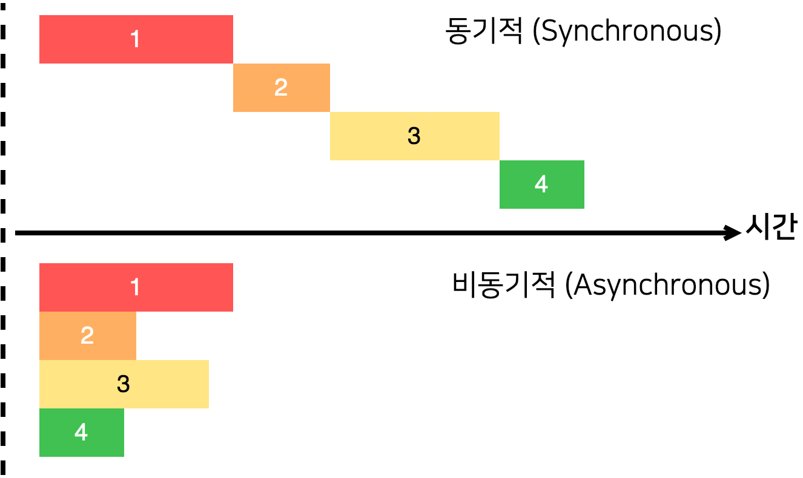
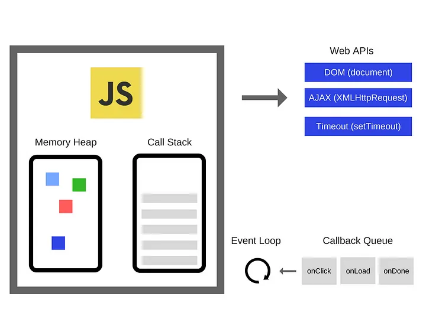

# JavaScript 비동기의 이해

## 목차
- [동기식과 비동기식](#동기식과-비동기식)
- [JS의 비동기](#js의-비동기)
  - [동작 과정](#동작-과정)
  - [비동기 내장함수](#비동기-내장함수)
  - [비동기 처리](#비동기-처리)
- [참고 자료](#참고-자료)

<br>

## 동기식과 비동기식



- 동기식 Synchronous

  데이터의 요청과 결과가 한 자리에서 동시에 일어나는 것을 말한다. 즉, 먼저 시작한 작업이 완전히 끝날 때까지 기다린 후 이후 작업이 이루어진다.

- 비동기식 Asynchronous

  데이터 요청에 대한 결과를 기다리지 않고 기다리는 동안 다른 작업을 수행할 수 있어 한 번에 여러 작업이 병렬적으로 처리 가능하다.


<br>

## JS의 비동기

### 동작 과정



JS는 싱글스레드 런타임을 가진 동기식 언어이다. 이런 JS가 비동기적으로 동작할 수 있는 것은 web 브라우저의 apis를 사용하기 때문이다. JS 동작의 흐름에서 크게 call stack, Web APIs, callback queue, event loop를 주요하게 살펴볼 수 있다.

- call stack : 기본적으로 프로그램 내의 현재 위치를 기록하는 데이터구조이다. 코드를 실행하면 실행되는 함수가 call stack에 push되고 실행이 완료되면 stack에서 pop된다. 이처럼 call stack에 쌓이는 각 항목을 stack frame이라고 한다.

- Web APIs : DOM, AJAX, Timeout(setTimeout) 이외에도 다양한 api가 있다.

- callback queue : 비동기 코드(메세지)가 실행을 대기하는 곳이다. 추가로 DOM에 지정한 event가 발생하면 새로운 메세지가 큐에 추가된다.

- event loop : call stack과 callback queue를 계속 주시하며 스택이 비어 있을 경우 queue에서 실행을 대기하고 있는 메세지를 순서대로 call stack으로 이동시킨다.  

```js
console.log('hi');

setTimeout(() => {
  console.log('There');  
}, 1000);

console.log('end');

// hi end There
```
이러한 코드가 있을 때 출력값은 코드의 순서와 다르다. 코드가 동작하는 과정을 설명해보겠다.

1. `console.log('hi');`가 call stack에 push된다.
2. `console.log('hi');`가 실행된 후 call stack에서 pop된다.
3. `setTimeout`이 call stack에 push된다.
4. 브라우저의 타이머가 작동하며 그 안의 `console.log('There');`(콜백함수)를 가지고 있는다.
5. `setTimeout`이 call stack에서 pop된다.
6. `console.log('end');`가 call stack에 push된다.
7. `console.log('end');`가 실행된 후 call stack에서 pop된다.
8. 1초가 지난 후 `console.log('There');`가 callback queue로 이동한다.
9. 이벤트 루프가 stack이 비어있고 queue에 메세지가 있는 것을 확인하여 `console.log('There');`가 call stack으로 이동한다.
10. `console.log('There');`가 실행된 후 call stack에서 pop된다.

이와 같이 비동기로 작동하는 함수는 콜백 큐에 쌓이고 이벤트 루프가 지속적으로 콜스택, 콜백큐를 확인한다. 콜스택이 비어있고 수행 대기 중인 메세지가 있으면 메세지를 콜스택으로 이동시켜 실행되는 구조이다. 

또 다른 예시로는 event listner가 있다. event listner를 적용한 DOM element에서 event가 발생하면 event handler가 콜백 큐에 추가된다.


### 비동기 내장함수

1. `setTimeout(function/code, delay)`

    지정한 함수나 코드를 실행할 타이머를 설정하는 것으로 delay에 설정한 시간이 경과한 후 함수/코드를 실행한다.
    
    주의) ‘this’를 사용할 때는 this를 호출 시 지정하지 않거나 bind로 바인딩하지 않으면 기본 값인 window를 가리키게 된다.

2. `fetch(resource, option)`

    네트워크에서 리소스를 얻는 절차를 시작하며 응답을 받아 사용 가능한 상태가 되면 이를 이행하는 promise를 반환한다.
    - resource : 얻으려는 리소스의 URL 또는 Request 객체
    - option : method(기본=GET, 이외 ‘POST’, ‘PUT’, ‘DELETE’), cache 등 다양하다. ([공식문서 참고](https://developer.mozilla.org/ko/docs/Web/API/fetch))

    ```js
    fetch('url')
      .then(callback func)
      .then(callback func)
      .catch(error handling)
    ```
    간략하게 하자면 이런 형식으로 쓰이는데 fetch로 Promise가 반환되고 이에 대해 `then`과 `catch`를 chaining하여 사용한다. 여기서 오해할 수 있는 부분은 fetch가 Promise를 반환할 때까지 blocking되었다가 반환하면 then이 실행된다고 생각할 수 있다. 하지만 fetch함수 동작 시 blocking 되는 것이 아니라 `then`은 응답을 받으면 수행될 callback 함수를 callback queue에 추가하는 것이고 나중에 응답이 오면 이 콜백함수가 콜스택으로 이동하여 실행되는 것이다!!

### 비동기 처리

1. callback 함수

    함수 사용 시 매개변수로 함수 객체를 전달하여 호출 함수 내에서 매개변수 함수를 실행하는 것이다.

2. Promise

    비동기 작업에서 예측되는 완료 또는 실패와 그 결과 값 을 나타낸다. 주로 네트워크의 데이터를 받아오거나 파일을 읽어오는 등 시간이 걸리는 작업을 비동기적으로 처리하기 위해 사용된다.
    - Promise 생성자를 통해 생성, 인자로 executor(실행자, 실행 함수)인  resolve와 reject callback함수를 받는다.
      ```js
      const myPromise = new Promise((resolve, reject) => {
      console.log('doing something...');
      resolve('successfully resolve');  // promise의 결과 값으로 'successfully resolve'을 반환하는 것
      // reject(new Error('error message'); // reject 시 error 반환
      }
      ```
    - PromiseStatus
      - pending : 해당 promise는 아직 resolve나 reject되지 않음
      - fulfilled : 해당 promise가 resolve됨
      - rejected : 해당 promise가 reject됨

    - Promise Method
      - `.then()` : promise가 resolve된 후 호출됨
      - `.catch()` : promise가 reject된 후 호출됨
      - `.finally()` : resolve되던 reject되던 항상 호출
      - 예시
        ```js
        function getImage(file) {
        return new Promise((resolve, reject) => {
          try {
            const data = readFile(file);
            resolve(data);
          } catch(err) {
            reject(new Error(err));
          }
        })

        getImage(file)
          .then(image => console.log(image))
          .catch(error => console.log(error))
          .finally(() => console.log('All done!'))
        ```

3. async & await

    async와 await은 비동기적인 코드에 동기적인 것처럼 순서를 부여하는 역할을 한다.
    - async는 기존의 Promise를 간결하게 작성 가능하며 암시적으로 Promise를 사용하여 promise 객체를 반환한다.
    - await은 async 함수 내에서 사용하며 async 함수의 실행을 일시 중지하고 전달된 Promise의 해결을 기다린 후 다시 실행한다.


<br>

## 참고 자료

https://developer.mozilla.org/ko/docs/Web/JavaScript/Event_loop

https://medium.com/sessionstack-blog/how-does-javascript-actually-work-part-1-b0bacc073cf

https://velog.io/@kim_unknown_/JavaScript-Asynchronous