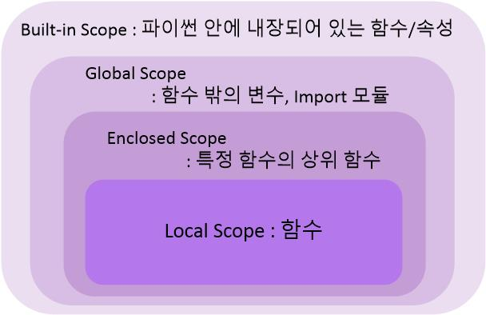

# 사용자 정의 함수

## 함수 기본 구조

`선언과 호출(define & call) - 입력(Input) - 범위(Scope) - 결과값(Output)`

### 선언 및 호출
- 함수 선언은 def 키워드를 활용

- 들여쓰기를 통해 Function body 작성

- 함수는 parameter를 넘겨줄 수 있음

- 동작 후 return을 통해 output 전달

- `함수명()` 으로 호출, parameter가 있는 경우 `함수명(x, y, z...)`로 호출
  ```python
  def function_name():
    return True

  def add(x, y):
    return x + y
  ```

### 함수의 Output
- 함수는 반드시 하나의 return값 반환

  - 명시적인 return이 없는 경우 None 반환

  - return값이 여러 개인 경우 tuple반환

- return과 동시에 함수의 실행 종료
  ```python
  def foo():
    return 1
    return 2  # 2는 반환되지 않음, return문이 한번 나오면 함수 종료
  ```

### 함수의 Input
```python
def function(ham):  # parameter
  return ham
  
function('spam')   # argument
```
- Parameter : 함수를 실행할 때 함수 내부에서 사용되는 식별자

- Argument : 함수를 호출할 때 넣어주는 값

  - 필수 Argument : 반드시 전달되어야 하는 argument

  - 선택 Argument : 값을 전달하지 않아도 되는 경우는 기본값이 전달, ex) print의 end, sep

  - 기본적으로 함수 호출 시 argument는 위치에 따라 함수 내에 전달

  - Keyword Arguments : 직접 지정 가능, ex) arg위치 다를 경우, open(file, encoding='utf8')

  - Default Arguments Values : 함수 선언 시 기본값 지정하여 호출 시 설정안해도 되도록!
    ```python
    def add(x, y=0):
      return x + y
    
    add(2)  # 2
    ```

  - 여러 개의 arguments : 몇 개의 값이든 받을 수 있도록 *(asterisk) 사용, \*는 tuple로, \*\*는 dictionary로
    ```python
    def add(*numbers):
      # print(type(numbers)) # tuple
      result = 0
      for n in numbers:
        result += n
      return result

    def movie(**kwargs):
      return kwargs
    
    movie(name='더글로리', writer='김은숙')
    print(movie)  # {'name'='더글로리', 'writer'='김은숙'}
    ```

### 함수의 범위(Scope)

- 함수는 코드 내부에 local scope를 생성하며 그 외의 공간은 global scope로 구분
  - global scope : 코드 어디서든 참조할 수 있는 공간
  - local scope : 함수가 만든 scope, 함수 내부에서만 참조 가능
  - global variable : global scope에 정의된 변수
  - local variable : local scope에 정의된 변수

- 객체는 각자의 생명주기(life cycle)가 존재
  - built-in scope : 파이썬이 실행된 이후부터 영원히 유지
  - global scope : 모듈이 호출된 시점 이후 혹은 인터프리터가 끝날 때까지 유지
  - local scope : 함수가 호출될 때 생성되어 종료 시까지 유지

  ```python
  # global scope
  a = 10

  # local scope
  def foo():
    b = 10

  foo()
  print(b) #NameError
  ```

- 이름 검색 규칙(Name Resolution)

  - 식별자(변수명)들은 각각의 name space에 저장
  - `LEGB Rule` : 함수 내에서는 바깥 Scope의 변수에 접근 가능하나 수정 불가능

    

  - global 문
  ```python
  a = 5
  def foo():
    print(a) 
  
  foo()  # 5, local scope에 a가 없으니 global variable a를 가져옴

  def boo():
    global a  # global scope에 있는 a를 가져옴
    a = 3
    print(a)
  
  boo()    # 3
  print(a)  # 3, local scope에 a를 가져와 바꾸면 global scope a가 바뀐 모습
  ```