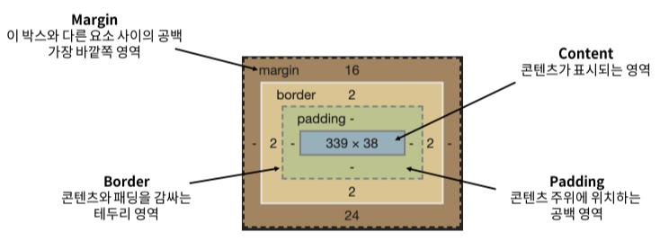
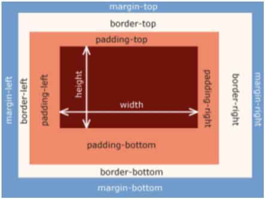

# CSS Box Model

> 모든 HTML 요소를 사각형 박스로 표현
> 
> 박스에 대한 크기, 여백, 테두리 등의 스타일을 지정한다는 디자인 개념

## 구성요소
### 박스의 구성



- Margin : 다른 박스와의 간격 조정

- Padding : 박스 안에서 컨텐츠의 상하좌우 이동

### 박스의 요소



: top, bottom, left, right, width, height

- width & height
  - 요소의 너비와 높이를 지정

  - 지정되는 요소의 너비와 높이는 컨텐츠 영역을 대상으로 함

- box-sizing
  - 요소의 너비와 높이를 계산하는 방법을 지정

  - 기본값은 content-box이며 border-box 기준으로 변경 가능
  ```css
  * {
    box-sizing: border-box;
  }
  ```

<br>

## 박스 타입
### Block
- 위에서 아래로 박스 배치 = 항상 새로운 행으로 나뉨

- width와 height 속성을 사용하여 너비와 높이 지정 가능

- 기본적으로 width 속성을 지정하지 않으면 박스는 inline 방향으로 사용가능한 공간을 모두 차지(너비 100% 채움)

- h1~6, p, div 태그 등이 해당


### Inline
- 좌에서 우로 박스 배치 = 새로운 행으로 나뉘지 않음

- width와 height 속성 사용할 수 없음

- padding, margin, borers가 적용되는데 수직방향으로는 다른 요소를 밀어내지 못하고 수평방향으로는 밀어낼 수 있음

- a, img, span 태그 등이 해당


### inline-block
- inline과 block 요소 사이의 중간 지점을 제공하는 display값

- 요소가 줄바꿈되는 것을 원하지 않으면서 너비와 높이를 적용하고 싶은 경우에 사용

- block요소의 특징에 따라 패딩, 여백 및 테두리로 인해 다른 요소가 상자에 밀려남

<br>

## 참고사항
### shorthand
- border : width, style, color를 한번에 설정
  ```css
  .class {
    border: 1px solid black;
  }
  ```

- margin & padding : 네 방향의 속성을 한번에 지정
  ```css
  /* 4개 - 상   우   하   좌 */
  margin: 10px 20px 30px 40px;

  /* 3개 -  상 | 좌우 | 하 */
  padding: 10px 20px 30px;

  /* 2개 - 상하 | 좌우 */
  margin: 10px 20px;

  /* 1개 - 상하좌우 모두 */
  padding: 10px;
  ```

### 마진 상쇄 Margin collapsing
- 두 block 타입 요소의 margin top과 bottom이 만나면 더 큰 margin이 반영됨
