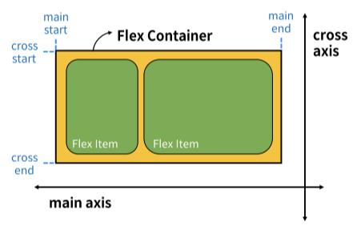

# CSS Layout

## CSS Float

> 요소를 띄워서 텍스트 및 인라인 요소가 그 주위를 감싸도록 하는 배치
> 
> 왼쪽 혹은 오른쪽으로 띄워 Normal flow에서 벗어남

ex) 신문 레이아웃

### 예제
```css
<head>
  ...
  <style>
    .box {
      width: 10rem;
      height: 10rem;
      border: 1px solid black;
      background-color: lightcoral;
      margin: 1rem;
    }

    .float-left {
      float: left;
    }

    .float-right {
      float: right;
    }

  </style>
</head>
<body>
  <div>
    <div class="box float-left">float left</div>
    <p>.....</p>
    <div class="box float-right">float right</div>
    <p>.....</p>
  </div>
</body>
```

<br>

## Flexible box for CSS layout

> 요소를 행과 열 형태로 배치하는 1차원 레이아웃 방식
> 
> 요소 간의 '공간배열'과 '정렬'

### Flexbox 기본 사항


- main axis (주 축)
  - flex item들이 배치되는 기본 축

  - main start에서 시작하여 main end 방향으로 배치

- cross axis (교차 축)
  - main axis에 수직인 축

  - cross start에서 시작하여 cross end 방향으로 배치

- Flex Container
  - `display: flex;` 혹은 `display: inline-flex;`가 설정된 부모 요소

  - 이 컨테이너의 1차 자식 요소들이 Flex Item이 됨

  - flexbox 속성 값들을 사용하여 자식 요소 Flex Item들을 배치

- Flex Item
  - Flex Container 내부에 레이아웃되는 항목


### Flexbox 속성
1. Flex Container 지정
    ```css
    display: flex;
    ```


2. flex-direction
    ```css
    flex-direction: column;
    flex-direction: row;
    flex-direction: column-reverse;
    flex-direction: row-reverse;
    ```
    - flex item이 나열되는 방향을 지정

    - 기본값은 row이며 column으로 지정 시 주축 변경됨

    - `row/column-reverse`로 지정하면 시작선과 끝선이 서로 바뀜


3. flex-wrap
    ```css
    flex-wrap: nowrap;
    flex-wrap: wrap;
    ```
    - nowrap이 기본값

    - flex item 목록이 flex container 하나의 행에 들어가지 않을 경우 다른 행에 배치


4. justify-content
    ```css
    justify-content: flex-start;
    justify-content: center;
    justify-content: flex-end;
    justify-content: space-between;
    justify-content: space-around;
    justify-content: space-evenly;
    ```
    - 주축을 따라 flex item과 주위에 공간을 분배


5. align-content
    ```css
    flex-wrap: wrap;

    align-content: flex-start;
    align-content: center; 
    align-content: flex-end;
    align-content: space-between;
    align-content: space-around;
    align-content: space-evenly;
    ```
    - 교차축을 따라 flex item과 주위에 공간을 분배

    - flex-wrap이 wrap또는 wrap-reverse로 설정된 여러 행에만 적용됨

    - 한줄짜리 행에 nowrap인 경우 효과 없음


6. align-items
    ```css
    align-items: stretch;
    align-items: flex-start;
    align-items: center;
    align-items: flex-end;
    ```
    - 한줄일 때 적용

    - 교차축을 따라 flex item행을 정렬


7. align-self
    ```css
    align-self: stretch;
    align-self: flex-start;
    align-self: center;
    align-self: flex-end;
    ```
    - 교차축을 따라 개별적으로 flex item에 속성을 부여하여 정렬


8. flex-grow
    ```css
    .item1 {
      background-color: red;
      flex-grow: 1;
    }

    .item1 {
      background-color: green;
      flex-grow: 2;
    }

    .item1 {
      background-color: blue;
      flex-grow: 3;
    }
    ```
    - 남는 행 여백을 비율에 따라 각 flex item에 분배

    - 각각의 flex item에 속성 부여


9. flex-shrink
    - flex-grow와 반대로 넘치는 너비를 비율에 따라 분배해서 줄임


10. flex-basis
    ```css
    flex-basis: 300px;
    ```
    - flex item의 최소 크기값을 지정

    - flex-basis와 width값을 동시에 적용한 경우 flex-basis가 우선
