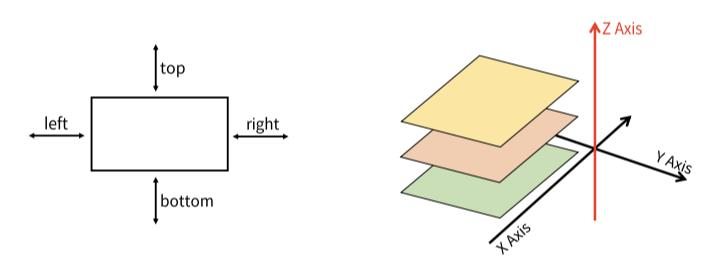

# CSS Layout

> 각 요소의 위치와 크기를 조정하여 웹 페이지의 디자인을 결정하는 것
> 
> Display, __Position__, Floats, Flexbox...

<br>

## CSS Position

> Normal Flow에서 요소를 끄집어내어 다른 위치로 배치하는 것
> 
> 다른 요소 위에 놓기, 화명 특정 위치에 고정시키기 

### Position 이동 방향


총 다섯 방향


### Position 유형
```html
<head>
  <style>
    * {
      box-sizing: border-box;
    }

    /* body길이를 늘리면 스크롤 생김 */
    body {
      height: 1500px;
    }

    .box {
      width: 100px;
      height: 100px;
      border: 1px solid black;
    }

    .container {
      width: 300px;
      height: 300px;
      border: 1px solid black;
      position: relative;
    }

    .static {
      position: static;
      background-color: lightcoral;
    }

    .absolute {
      position: absolute;
      background-color: lightgreen;
      left: 100px;
    }

    .relative {
      position: relative;
      background-color: lightblue;
      left: 100px;
      top: 100px;
    }

    .fixed {
      position: fixed;
      background-color: grey;
      top: 0;
      right: 0;
    }
  </style>
</head>
<body>
  <div class="container">
    <div class="box static">static</div>
    <div class="box absolute">absolute</div>
    <div class="box relative">relative</div>
    <div class="box fixed">fixed</div>
  </div>
</body>
```
1. static
    - 기본값

    - 요소를 Normal Flow에 따라 배치

2. relative
    - 요소를 Normal Flow에 따라 배치

    - 자기 자신을 기준으로 이동

    - 요소가 차지하는 공간은 static일 때와 같음

3. absolute
    - 요소를 Normal Flow에서 제거

    - 가장 가까운 relative 부모 요소를 기준으로 이동

    - 문서에서 요소가 차지하는 공간이 없어짐

4. fixed
    - 요소를 Normal Flow에서 제거

    - 현재 화면영역(viewport)을 기준으로 이동

    - 문서에서 요소가 차지하는 공간이 없어짐

```html
<head>
  ...
  <style>
    body {
      height: 1500px;
    }

    .sticky {
      position: sticky;
      background-color: lightblue;
      border: 1px solid black;
      top: 0;
    }
  </style>
</head>
<body>
  <div>
    <div class="sticky">sticky</div>
    <div> aa </div>
    <div class="sticky">sticky</div>
    <div> aa </div>
  </div>
</body>
```

5. sticky
    - 요소를 Normal Flow에 따라 배치

    - 가장 가까운 block 부모 요소를 기준으로 이동

    - 요소가 특정 임계점에 스크롤될 때 그 위치에 고정됨(fixed)

    - 만약 다음 sticky 요소가 나오면 위치가 겹쳐 다음 sticky 요소가 이전 sticky 요소의 자리를 대체


### z-index

: 요소가 겹쳤을 때 어떤 요소 순으로 위에 나타낼 지 결정
```css
z-index: 2;
```
- 클래스에 위와 같이 z-index의 값(정수)을 지정하여 적용

- 더 큰 값을 가진 요소가 작은 값의 요소를 덮음
